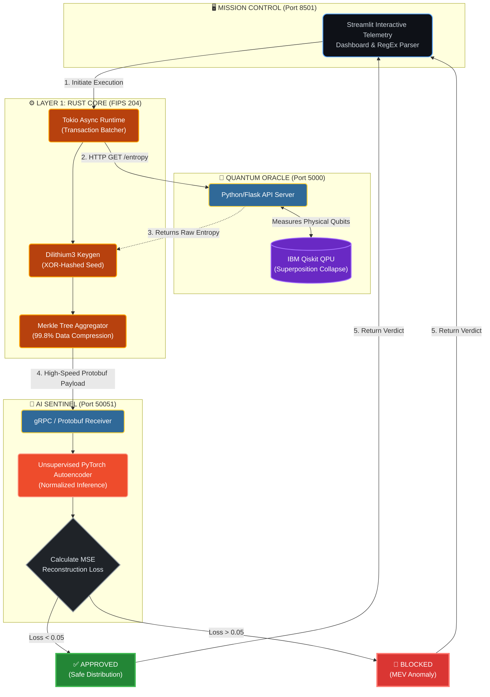

<div align="center">

# 🌌 QuantumGrid PLUS
**The AI-Governed, Quantum-Sovereign Immutable Ledger**

[](https://www.rust-lang.org/)
[](https://pytorch.org/)
[-blue.svg)](https://csrc.nist.gov/)
[](https://quantum.ibm.com/)
[](https://grpc.io/)

QuantumGrid PLUS is a flagship DeepTech infrastructure prototype designed to address the "Four Horsemen" of next-generation computer science: **Post-Quantum Cryptography (PQC), Quantum Computing, Blockchain, and Machine Learning.**

It acts as a next-generation Layer-1 node architecture that replaces legacy elliptic curve cryptography with quantum-resistant identities, eliminates PQC data bloat via Merkle Tree aggregation, and utilizes an unsupervised Deep Learning Autoencoder to detect zero-day MEV (Maximal Extractable Value) exploits in the mempool before consensus.

</div>

---

## 🚀 The Architecture (4-Tier Microservices)

Unlike monolithic blockchains, QuantumGrid PLUS operates on a highly decoupled, fault-tolerant gRPC architecture.

### 1. The Quantum Oracle (`Python/Flask + IBM Qiskit`)
Standard CSPRNGs (Pseudo-Random Number Generators) rely on deterministic OS noise, creating vulnerabilities for wallet generation. The Oracle forces qubits into a 50/50 superposition state, measures the physical collapse of the wave function, and returns true physical entropy. To prevent API single-point-of-failure, this is **XOR-hashed with local OS entropy** to create a secure Hybrid Seed.

### 2. The Core Ledger (`Rust + FIPS 204`)
Written in high-performance memory-safe Rust, the core handles Post-Quantum identity generation. It implements **NIST FIPS 204 (Dilithium3)** standards. 
**The Bloat Solution:** Because Dilithium3 signatures are massive (~3,300 bytes), the Rust core batches transactions and calculates a **Merkle Tree Root**. This cryptographic aggregation compresses batch state verification down to a single 32-byte hash, achieving a **99.8% space savings** on-chain.

### 3. The AI Sentinel (`Python + PyTorch + gRPC`)
Instead of hardcoded consensus rules, the mempool is governed by an Unsupervised PyTorch Autoencoder. The Neural Network was trained on thousands of "normal" blockchain states. When a new gRPC transaction payload arrives, the network attempts to reconstruct the data.
* **Mathematical Anomaly Detection:** $MSE = \frac{1}{n}\sum_{i=1}^{n}(Y_i - \hat{Y_i})^2$. If the Mean Squared Error (Reconstruction Loss) exceeds strict structural thresholds (e.g., a predatory MEV front-running pattern), the transaction is blocked before propagating to peer nodes.

### 4. Mission Control (`Streamlit UI`)
A real-time, interactive frontend that visually breaks down the gRPC telemetry, Merkle compression ratios, and live AI neural reconstruction loss scoring.

---

## 🛠️ System Flow Diagram



### ⚙️ Quick Start Guide (GitHub Codespaces)
This project is fully dockerized and optimized for a cloud-native DevContainer environment.

1. Boot the Quantum Oracle (Terminal 1)

```Bash
cd quantum_oracle
python3 oracle.py
```
# Runs on localhost:5000

2. Boot the Deep Learning Brain (Terminal 2)

```Bash
cd ai_sentinel
python3 server.py
```
# Runs on gRPC port 50051

3. Launch Mission Control (Terminal 3)

```Bash
cd dashboard
streamlit run app.py
```
# Opens interactive UI in browser (Port 8501)

(Note: The Rust Core is executed dynamically by the Streamlit UI to demonstrate live transaction batches, data compression, and real-time AI inference).


### 📊 Security & SWOT Highlights
* **NIST-Aligned Sovereignty:** Utilizes FIPS 204 (Dilithium3) standards, effectively mitigating "Harvest Now, Decrypt Later" attacks by Shor's Algorithm.

* **Hybrid Entropy Resiliency:** Does not rely solely on the Quantum QPU. It XOR-hashes Quantum bits with Classical OS bits, preventing single-point-of-failure API dependency.

* **Fault-Tolerant AI Governance:** The AI runs out-of-band via gRPC. If the AI service crashes, the Rust blockchain core remains online and defaults to strict security parameters.


### 📊 DeepTech Innovations & Metrics
* **PQC Data Optimization:** Successfully reduced 13,000+ byte transaction batches to a 32-byte verifiable state identifier (Merkle Root).

* **Deterministic ML Bypassed:** Shifted from static rules to dynamic statistical reconstruction, allowing the node to detect unknown (zero-day) economic attacks based purely on mathematical deviation.

* **High-Speed IPC:** Replaced standard REST JSON APIs with Google's Protocol Buffers (Protobuf) over HTTP/2, ensuring the AI inference step does not bottleneck the blockchain's TPS (Transactions Per Second).

* **Engineered for maximum security and autonomy.**

### 📜 License
Distributed under the **MIT License**. See LICENSE for more information.

<div align="center">


<b>Architected and Engineered for the Post-Quantum Era.</b>
</div>
